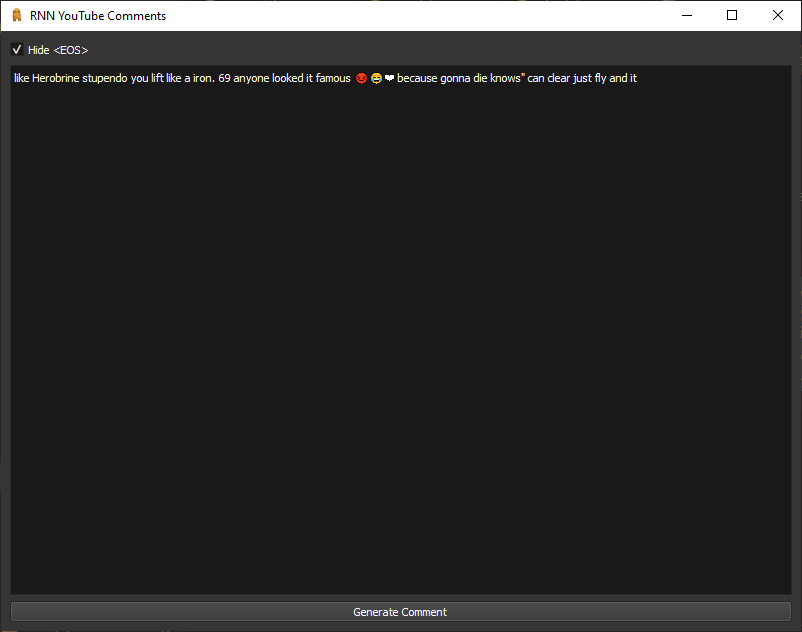

# RNN YouTube Comments
A recurrent neural network to generate new YouTube comments from existing ones.

## What Does This Do?
Given several youtube links, this will use [yt-dlp](https://github.com/yt-dlp/yt-dlp) to download all of the comments from those videos. It will then put the comments through a recurrent neural network (RNN) and provide you with a GUI that will create brand new comments based on the existing ones.

## Why Did You Make This?
On some types of YouTube videos, such as shorts made for children, you'll see many comments that are unintelligible, use lots of emojis and feature many brainrot words. I wanted to see if I could make a simple text generation model to try and mimic these types of comments.

## How Do I Use This?
1. Install the requirements using `pip install -r requirements.txt`.

### I Don't Want To Train My Own Model
2. If you don't want to train your own model with your own links, simply just run `gui.py` and use the GUI to generate new comments. The existing model, `rnn_model.pth` is currently trained on 10,000 of these brainrot comments.

### I Want To Train My Own Model
2. Collect the links of various YouTube videos that feature the type of comments that you want to replicate.
3. Put these links in `links.txt`, each on a new line.
4. Run `download.py`. Be careful, as this uses YouTube's API to download comments. You could get rate limited.
5. Train the model by running `train.py`. You can modify the `max_comments` variable to determine how many comments from the dataset will be used for training. Currently it is set to 10,000, but you can increase it if you have a lot of VRAM.
6. Run the model using `gui.py`.

## Misc Info
You can run `create-comments-list.py` to create a list of all comments in your dataset at `comments.txt`. This is useful to see if the comments you're generating are copies of comments in the dataset or if they're new. If some comments are copies, you are likely training too many epochs and overfitting the dataset. Consider reducing the number of epochs.

## Gallery
